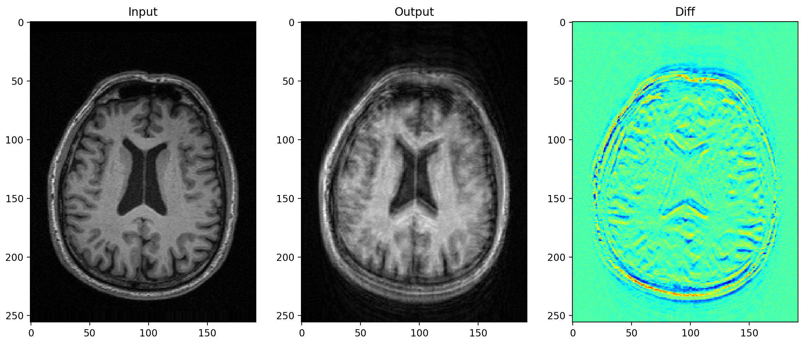

# MRI Motion Model

This python code can be used to generate patient movement artefacts in MRI scans.\
It can be applied to both 2D or 3D images.\
Please find the examples.py code to see how it can be used in your projects.\
The code can be used for data augmentation in Deep Learning pipelines and can be integrated with Torchvision transforms.

# Citation

If you use this code, please consider citing my papers:\

@ARTICLE{Shaw2019,
<pre>author={R. {Shaw} and C. H. {Sudre} and T. {Varsavsky} and S. {Ourselin} and M. J. {Cardoso}},\
    journal={IEEE Transactions on Medical Imaging},\
    title={A k-Space Model of Movement Artefacts: Application to Segmentation Augmentation and Artefact Removal},\
    year={2020},\
    volume={39},\
    number={9},\
    pages={2881-2892},\
    doi={10.1109/TMI.2020.2972547}}

@inproceedings{Shaw2019,\
<pre>title={MRI k-Space Motion Artefact Augmentation: Model Robustness and Task-Specific Uncertainty},\
  author={R. Shaw and C. Sudre and S. Ourselin and M. Cardoso},\
  booktitle={MIDL},\
  year={2019}
}
